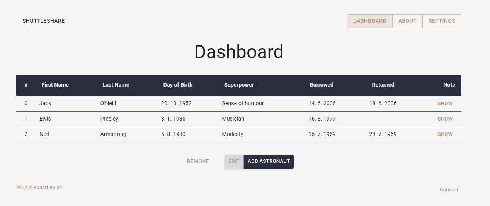

# ShuttleShare
v0.8.0
> _Know who got dirty your shuttle._

<br>



<br>


Aplikace slouží pro jednoduchou správu astronatů, kteří si zapůjčili raketoplán v rámci naší služby - **Shuttle Share**.

Kromě toho posloužila pro studijní účely, kdy jsem si vyzkoušel práci s technologiemi, které jsem do té doby neznal.

<br>


## Použití
Aplikaci lze vyzkoušet na adrese [https://shareshuttle.netlify.app/](https://shareshuttle.netlify.app/) nebo ji lze spustit lokálně.


```bash
git clone https://github.com/robert-belan/ShuttleShare.git
cd ShuttleShare
npm install
npm run start
```

<br>


## Využité technologie

#### Frontend
- JavaScript
- React
- [MUI](https://mui.com/) - UI knihovna React komponent

#### Backend
- [Firebase](https://firebase.google.com/) - Realtime Database

#### Deploy
- [Netlify](https://www.netlify.com/)

<br>


## Co jsem se naučil

- Skvěle jsem se seznámil s knihovnou **MUI** obsahující React komponenty. Chce to ještě další "průzkum", ale již nyní dokáži s MUI komponent dostat, co potřebuji, a v případě potřeby si komponenty také "ohnout" k obrazu svému. Některé věci jsem však ještě nerozklíčoval, těm se věnuji nyní.

- **CRUD operace** s využitím Firebase od Googlu.
  - nějakou dobu jsem strávil nad tím, jak skrýt konfigurační údaje pro inicializaci Firebase databáze
  - v případě, že celý kód běží na straně klienta, je nemožné zcela skrýt tyto údaje a kdokoli, kdo tyto údaje zjistí, může databázi upravovat dle svého
  - v tomto případě jsem přístup k databázi omezil na pouze takové HTTP požadavky, které v HTTP hlavičce obsahují správný HTTP referer
  
- Díky **Netlify** jsem zjistil, že existuje něco čemu se říká server-side funkce. Práci s nimi jsem si vyzkoušel.

- Rozšířil jsem si znalosti o konfiguraci **Webpacku**.

- Záměrně jsem si chtěl zkusit vytvořit dvě **různé jazykové lokalizace**. Aplikace má dvě varianty, českou a anglickou. Způsob, který jsem použil je značně inspirován tímto [návodem](https://dev.to/halilcanozcelik/create-a-multi-language-website-with-react-context-api-4i27). Řešení funguje, ale způsob, kterým kód získává správnou jazykovou variantu slov, mi nevyhovuje. Soubory, které slouží jako slovníky se špatně strukturují a jsou málo přehledné. Pro příště zvolím jiný způsob.
